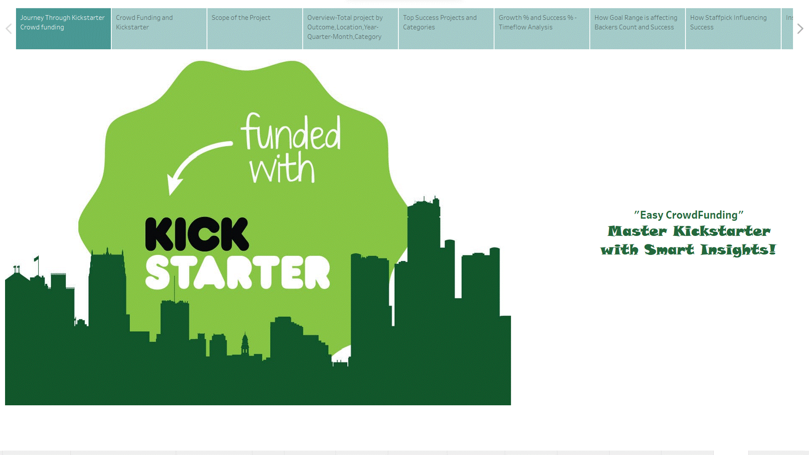

### CROWD FUNDING

Crowdfunding is the practice of funding a project or venture by raising money from a large number of people, typically via the internet. Crowdfunding is a form of crowdsourcing and alternative finance. 
 crowdfunding model is generally based on three types of actors 
 
- Project initiator who proposes the idea or project to be funded (Creators) 
- Individuals or groups who support the idea(Backers)
- Moderating organization (the "platform") that brings the parties together to launch the idea(Kickstarter, GoFundMe etc).

[Read More](https://en.wikipedia.org/wiki/Crowdfunding)

### KICKSTARTER

Kickstarter is an American public benefit corporation based in Brooklyn, New York, that maintains a global crowdfunding platform focused on creativity. The company's stated mission is to "help bring creative projects to life"
As of February 2023, Kickstarter has received US$7 billion in pledges from 21.7 million backers to fund 233,626 projects

Kickstarter is a crowdfunding platform that allows creators to raise funds for their projects or ideas from a large number of people, often referred to as backers. The platform enables individuals or groups with creative projects, such as art, music, films, technology, or other innovative ideas, to present their concepts to the public. Backers, in turn, can contribute money to support these projects.

The funding process on Kickstarter is all-or-nothing, meaning that a project must reach its funding goal within a specified time frame,  or no funds are collected, and the project does not move forward. If the project reaches or exceeds its funding goal, the creators receive the pledged funds to bring their idea to life. In return, backers may receive rewards or incentives based on the amount of money they contributed, such as early access to the product, special editions, or other exclusive perks.

The Kickstarter platform is open to backers from anywhere in the world and to creators from many countries, including the US, UK, Canada,Australia, New Zealand, The Netherlands, Denmark, Ireland, Norway, Sweden, Spain, France, Germany, Austria, Italy, Belgium, Luxembourg, Switzerland and Mexico. [Know more about Kickstarter](https://en.wikipedia.org/wiki/Kickstarter)

- If a project is successfully funded, Kickstarter applies a 5% fee to the funds collected. All pledges are processed securely by our third party payments partner, Stripe
- These payment processing fees work out to roughly 3.5%. View the fee breakdowns. 
- If the project does not reach its funding goal, there are no fees. 

Kickstarter has been a popular platform for both creative individuals seeking financial support and backers looking to be part of bringing unique projects to fruition.

### OBJECTIVE

The objective of this project is to conduct a comprehensive analysis of crowdfunding activities on Kickstarter with the aim of gaining insights into the dynamics, trends, and key factors influencing the success or failure of campaigns.

### ABOUT THE DATA:
The dataset utilized for this analysis was provided by the ExcelR Data Analysis Training Institute as part of an internship project. It consists of seven 4 Excel Workbooks, encompassing FactProject,DimCategory,DimCreator,Dimlocation data. The data spans from 2009 to 2019 consisting of around 3.65 lakh data.

##### To view the analyses conducted using Tableau and Power BI, please click on the link provided below to explore the work accomplished in both tools 
[Analysis using Tableau](Tableau.md)  
[Analysis using Power BI](PowerBI.md)

## Tableau Story

